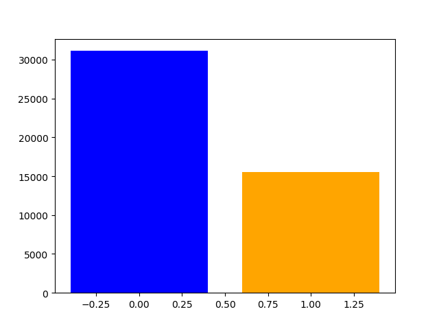

<h1><center>Mortgage Default Classification</center></h1>
    <center>By Tina Nguyen</center>

## Introduction

Mortgage default occurs when a borrower fails to make a repayment to the lender. This project analyzes the characterics of borrowers and loans that would later default using the data available at origination. Being able to flag a bad loan before making a funding decision is an ideal scenario for both the lenders and borrowers. The lenders would be more careful about funding that loan, while the borrowers, if rejected, are not taking more debt than they can repay. Therefore, being able to flag a loan at the origination state is very important. 

## Data

### Data Source

This project uses Freddie Mac Single Family Loan Level Data and performs analysis on all loans funded by Freddie Mac between 2010 and 2018. The data was obtained from Freddie Mac website in as zip files. Every zip file contains data of the entire year which was broken down into data of each quarter. Each quarter contains two different text files: (1) Origination Data and (2) Performance Data. The structure of the data is as follow:  
<ul>
    <li>historical_data_200X.zip</li>
    <ul>
        <li>historical_data1_Q1200X.zip</li>
        <li>historical_data1_Q2200X.zip</li>
        <li>historical_data1_Q3200X.zip</li>
        <li>historical_data1_Q4200X.zip</li>
        <ul>
            <li>historical_data1_Q1200X.txt (Origination Data)</li>
            <li>historical_data1_time_Q1200X.txt (Performance Data)</li>
        </ul></ul></ul>
      
The 30-year fixed mortgage interest rate downloaded from Freddie Mac website contains the monthly interest rate for 30-year fix-rate mortgages between 2013 and 2018. This variable was later used in calculating the rate of Spread at Origination (SATO). 
The Origination data contains variables that indicate the characteristics of the borrowers, the loans, and the properties. More specifically:
<ol>
<li>	Borrower characteristics: Credit Score, First Time Homebuyer, Debt-to-Income (DTI), Total number of Borrowers </li>
<li>	Loans characteristics: Date of First Payment, Maturity Date, Mortgage Insurance (MI) Percentage, Combined Loan-to-Value, Loan-to-Value (LTV), Interest Rate, Channel, Loan Purpose, Term, Seller, Servicer, Conformity Flag, Unpaid Principal Balance, Quarter and Year when the loan was funded </li>
<li>	Property characteristics: Metropolitan Statistical Areas (MSA) , Unit, Occupancy Status, Property State, Property Type, Postal Code </li>
 </ol>  
 
  
_Figure 1. First 5 rows of origination data_  
<br>
The Performance data contains information on how the loans perform monthly. It contains variable such as Current Unpaid Principal Balance, Loan Status, Loan Age, Number of Years to Maturity, etc. For the purpose of this study, only variable Loan Status from Performance data was used.
      

### Data Preprocessing

<ul>
    <li>Extract zip files into text files </li>
    <li>Import all origination files, concatenate them into one dataframe, and replace placeholder values with NaN </li>
    <li>Select loans that delinquent for more than 90 days from performance data</li>
    <li>Merge unique loan ids from performance data to orignation data</li>
    <li>Remove all NaN values </li>
    <li>Calculate the average interest rate for every quarter using Excel</li>
    <li>Merge the quarterly interest rate to the master dataframe</li>
    <li>Calculate the Spread at Orgination (SATO) rate </li>
    <strong>SATO (%) = Average Fixed Rate - Stated Interest Rate</strong>
</ul>

## Exploratory Data Analysis

### Geographic distrubution of loans


```python
%%HTML
<div class='tableauPlaceholder' id='viz1588548358257' style='position: relative'><noscript><a href='#'></a></noscript><object class='tableauViz'  style='display:none;'><param name='host_url' value='https%3A%2F%2Fpublic.tableau.com%2F' /> <param name='embed_code_version' value='3' /> <param name='site_root' value='' /><param name='name' value='EDA_15881893307010&#47;Dashboard2' /><param name='tabs' value='yes' /><param name='toolbar' value='yes' /><param name='static_image' value='https:&#47;&#47;public.tableau.com&#47;static&#47;images&#47;ED&#47;EDA_15881893307010&#47;Dashboard2&#47;1.png' /> <param name='animate_transition' value='yes' /><param name='display_static_image' value='yes' /><param name='display_spinner' value='yes' /><param name='display_overlay' value='yes' /><param name='display_count' value='yes' /></object></div>                <script type='text/javascript'>                    var divElement = document.getElementById('viz1588548358257');                    var vizElement = divElement.getElementsByTagName('object')[0];                    if ( divElement.offsetWidth > 800 ) { vizElement.style.minWidth='1000px';vizElement.style.maxWidth='100%';vizElement.style.minHeight='850px';vizElement.style.maxHeight=(divElement.offsetWidth*0.75)+'px';} else if ( divElement.offsetWidth > 500 ) { vizElement.style.minWidth='1000px';vizElement.style.maxWidth='100%';vizElement.style.minHeight='850px';vizElement.style.maxHeight=(divElement.offsetWidth*0.75)+'px';} else { vizElement.style.width='100%';vizElement.style.minHeight='750px';vizElement.style.maxHeight=(divElement.offsetWidth*1.77)+'px';}                     var scriptElement = document.createElement('script');                    scriptElement.src = 'https://public.tableau.com/javascripts/api/viz_v1.js';                    vizElement.parentNode.insertBefore(scriptElement, vizElement);                </script>
```


<div class='tableauPlaceholder' id='viz1588548358257' style='position: relative'><noscript><a href='#'></a></noscript><object class='tableauViz'  style='display:none;'><param name='host_url' value='https%3A%2F%2Fpublic.tableau.com%2F' /> <param name='embed_code_version' value='3' /> <param name='site_root' value='' /><param name='name' value='EDA_15881893307010&#47;Dashboard2' /><param name='tabs' value='yes' /><param name='toolbar' value='yes' /><param name='static_image' value='https:&#47;&#47;public.tableau.com&#47;static&#47;images&#47;ED&#47;EDA_15881893307010&#47;Dashboard2&#47;1.png' /> <param name='animate_transition' value='yes' /><param name='display_static_image' value='yes' /><param name='display_spinner' value='yes' /><param name='display_overlay' value='yes' /><param name='display_count' value='yes' /></object></div>                <script type='text/javascript'>                    var divElement = document.getElementById('viz1588548358257');                    var vizElement = divElement.getElementsByTagName('object')[0];                    if ( divElement.offsetWidth > 800 ) { vizElement.style.minWidth='1000px';vizElement.style.maxWidth='100%';vizElement.style.minHeight='850px';vizElement.style.maxHeight=(divElement.offsetWidth*0.75)+'px';} else if ( divElement.offsetWidth > 500 ) { vizElement.style.minWidth='1000px';vizElement.style.maxWidth='100%';vizElement.style.minHeight='850px';vizElement.style.maxHeight=(divElement.offsetWidth*0.75)+'px';} else { vizElement.style.width='100%';vizElement.style.minHeight='750px';vizElement.style.maxHeight=(divElement.offsetWidth*1.77)+'px';}                     var scriptElement = document.createElement('script');                    scriptElement.src = 'https://public.tableau.com/javascripts/api/viz_v1.js';                    vizElement.parentNode.insertBefore(scriptElement, vizElement);                </script>


During the 2013-2018 period, Freddie Mac purchased the most properties in California, Texas, Florida, and Ohio. These states were also the ones with the highest delinquency rates. The total number of delinquency in these made up of about 50% of all delinquency in the US. 

### Borrowers and Loans' Characteristics


```python
%%HTML
<div class='tableauPlaceholder' id='viz1588547985548' style='position: relative'><noscript><a href='#'></a></noscript><object class='tableauViz'  style='display:none;'><param name='host_url' value='https%3A%2F%2Fpublic.tableau.com%2F' /> <param name='embed_code_version' value='3' /> <param name='path' value='shared&#47;GWWWB836C' /> <param name='toolbar' value='yes' /><param name='static_image' value='https:&#47;&#47;public.tableau.com&#47;static&#47;images&#47;GW&#47;GWWWB836C&#47;1.png' /> <param name='animate_transition' value='yes' /><param name='display_static_image' value='yes' /><param name='display_spinner' value='yes' /><param name='display_overlay' value='yes' /><param name='display_count' value='yes' /><param name='filter' value='publish=yes' /></object></div>                <script type='text/javascript'>                    var divElement = document.getElementById('viz1588547985548');                    var vizElement = divElement.getElementsByTagName('object')[0];                    if ( divElement.offsetWidth > 800 ) { vizElement.style.width='1000px';vizElement.style.height='827px';} else if ( divElement.offsetWidth > 500 ) { vizElement.style.width='1000px';vizElement.style.height='827px';} else { vizElement.style.width='100%';vizElement.style.height='727px';}                     var scriptElement = document.createElement('script');                    scriptElement.src = 'https://public.tableau.com/javascripts/api/viz_v1.js';                    vizElement.parentNode.insertBefore(scriptElement, vizElement);                </script>
```


<div class='tableauPlaceholder' id='viz1588547985548' style='position: relative'><noscript><a href='#'></a></noscript><object class='tableauViz'  style='display:none;'><param name='host_url' value='https%3A%2F%2Fpublic.tableau.com%2F' /> <param name='embed_code_version' value='3' /> <param name='path' value='shared&#47;GWWWB836C' /> <param name='toolbar' value='yes' /><param name='static_image' value='https:&#47;&#47;public.tableau.com&#47;static&#47;images&#47;GW&#47;GWWWB836C&#47;1.png' /> <param name='animate_transition' value='yes' /><param name='display_static_image' value='yes' /><param name='display_spinner' value='yes' /><param name='display_overlay' value='yes' /><param name='display_count' value='yes' /><param name='filter' value='publish=yes' /></object></div>                <script type='text/javascript'>                    var divElement = document.getElementById('viz1588547985548');                    var vizElement = divElement.getElementsByTagName('object')[0];                    if ( divElement.offsetWidth > 800 ) { vizElement.style.width='1000px';vizElement.style.height='827px';} else if ( divElement.offsetWidth > 500 ) { vizElement.style.width='1000px';vizElement.style.height='827px';} else { vizElement.style.width='100%';vizElement.style.height='727px';}                     var scriptElement = document.createElement('script');                    scriptElement.src = 'https://public.tableau.com/javascripts/api/viz_v1.js';                    vizElement.parentNode.insertBefore(scriptElement, vizElement);                </script>


The plots above calculate the average of each numberical characteristics and compare between performning loans and delinquent loans.  
<br>
Overall, average DTI, LTV, MI percentage, and interest rate of default loans are higher than performing loans.  
<br>
Average credit score and SATO rate of delinquent loans are higher than performing loans. The wide gap in SATO rate between these loan statuses indicates on average, both perfoming loans and delinquent loans received higher interest rates than market average. Additionally, loans that would later delinquent received a much higher interest rates at origination than loans that would later perform.

## Modeling

Before modeling, One Hot Encoder was applied to categorical values and Label Encoder was applied to the target. The data was standardized and split into training and testing sets with the ratio of 7:3. The dataset was resampled twice to compare the results of different sampling techinques.   
Classifiers such as Logistic Regression, Decision Tree, and XGBoost were applied.  
Models were evaluated using precision score.

### Base Model


<table style="width:100%">
  <tr>
    <th>Model</th>
    <th>Precision Score Training</th>
    <th>F1 Score Training</th>
    <th>Precision Score Testing</th>
    <th>F1 Score Testing</th>
  </tr>
  <tr>
    <td>Logistic Regression</td>
      <td>0.996</td>
      <td>0.498</td>
    <td>0.992</td>
    <td>0.996</td>
  </tr>
  <tr>
    <td>Decision Tree</td>
    <td>1.0</td>
      <td>1.0</td>
      <td>0.512</td>
    <td>0.514</td>
  </tr>
    <tr>
    <td>XGBoost</td>
        <td>0.996</td>
        <td>0.500</td>
    <td>0.829</td>
    <td>0.499</td>
  </tr>
</table>

### Undersampling 50% - 1:2 ratio



<table style="width:100%">
  <tr>
    <th>Model</th>
    <th>Precision Score Training</th>
    <th>F1 Score Training</th>
    <th>Precision Score Testing</th>
    <th>F1 Score Testing</th>
  </tr>
  <tr>
    <td>Logistic Regression</td>
      <td>0.752</td>
      <td>0.735</td>
    <td>0.515</td>
    <td>0.497</td>
  </tr>
  <tr>
    <td>Decision Tree</td>
    <td>1.0</td>
      <td>1.0</td>
      <td>0.507</td>
    <td>0.452</td>
  </tr>
    <tr>
    <td>XGBoost</td>
        <td>0.817</td>
        <td>0.809</td>
    <td>0.515</td>
    <td>0.494</td>
  </tr>
</table>

### Combination - Oversampling 20% and Undersampling 30%


<table style="width:100%">
  <tr>
    <th>Model</th>
    <th>Precision Score Training</th>
    <th>F1 Score Training</th>
    <th>Precision Score Testing</th>
    <th>F1 Score Testing</th>
  </tr>
  <tr>
    <td>Logistic Regression</td>
      <td>0.747</td>
      <td>0.695</td>
    <td>0.521</td>
    <td>0.524</td>
  </tr>
  <tr>
    <td>Decision Tree</td>
    <td>1.0</td>
      <td>1.0</td>
      <td>0.511</td>
    <td>0.514</td>
  </tr>
    <tr>
    <td>XGBoost</td>
        <td>0.792</td>
        <td>0.761</td>
    <td>0.523</td>
    <td>0.526</td>
  </tr>
</table>

## Conclusion

Through extensive analysis, this study:
<ul>
<li>Identified the states with the most delinquency rate</li>
<li>Profiled the characteristics of delinquent and performing loans</li>
<ul><li>Discovered the relationship between SATO and delinquent loans</li></ul>
<li>Experimented with different combinations of classifiers and resampling techniques</li>
    </ul>
